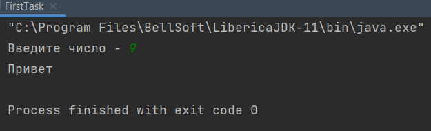
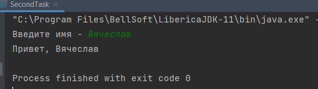
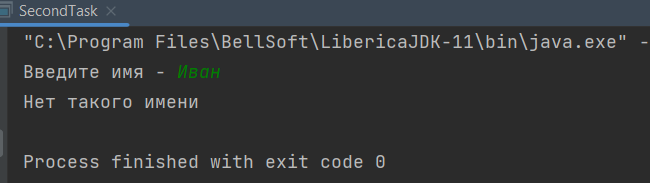
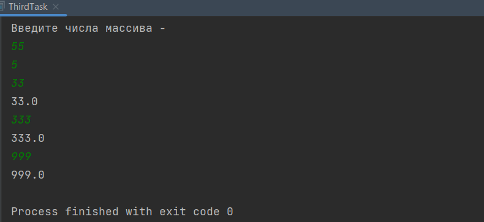

# Техническое задание QA Automation Trainee

### 1 Задание

Результат

-----------------

### 2 Задание

Результат

-----

### 3 Задание

Результат

### 4 Задание

Последовательность [((())()(())]] неправильная.
Потому что в последовательности нехватает двух скобок.
Нужно добавить одну квадратную скобку, и одну круглую скобку.
Правильная последовательность [((())()(()))[]], или [[((())()(()))]], и тд...
